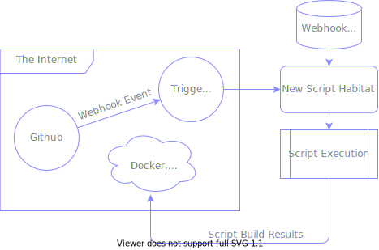
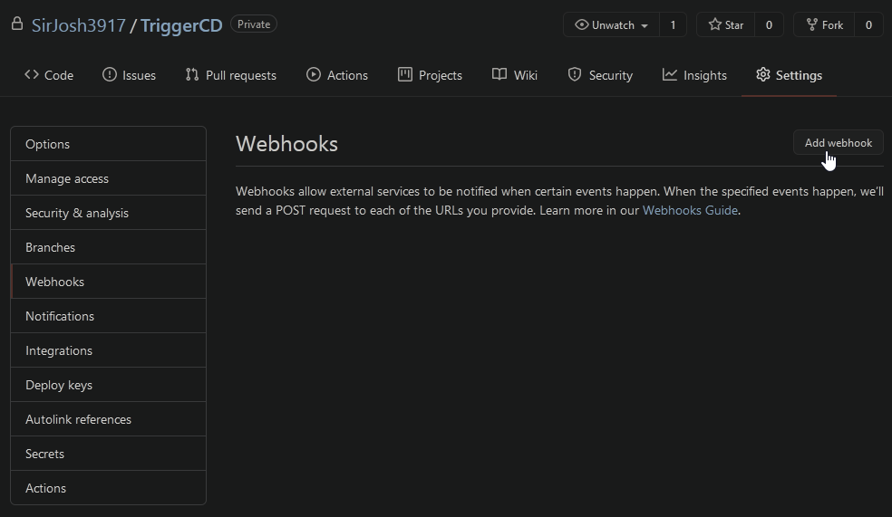
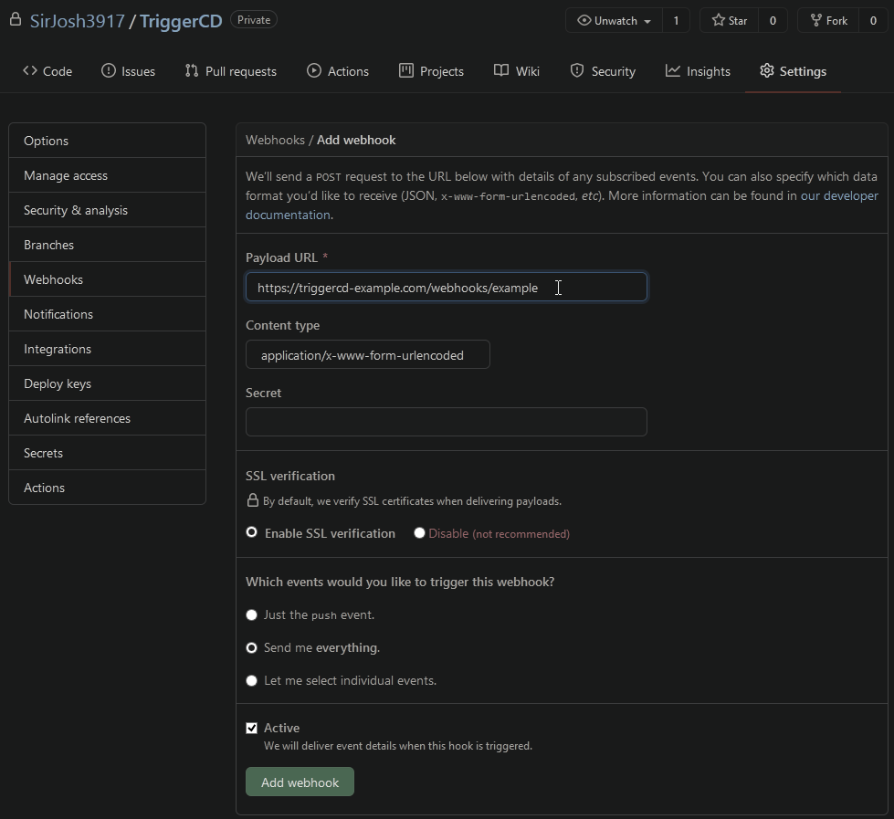

# <div align="center">TriggerCD</div>
<div align="center">

  [](https://github.com/SirJosh3917/TriggerCD/blob/master/LICENSE)

  *Setup Continuous Deployment. Now. No abstract config, just shell scripts.*

</div>

## What is TriggerCD?
- **Fast** — experience massive speed improvements in your deployments, as the scripts that run your code aren't containerized, allowing them to take full advantage of the caching mechanisms of popular build tooling (such as docker, deno, the compiler for your favorite language, etc.).
- **Simple** — by removing the need for abstract yaml configuration files and replacing them for more traditional shell scripts, you can be more productive as you no longer need to consult technology-specific documentation. It's just shell scripts!

# How


**TriggerCD** has a simple, linear workflow that's easy to follow.

1. A running instance of TriggerCD gets notified that a commit was made via GitHub Webhooks.
2. A new [habitat](#habitats) for the script to run is prepared, using the [Webhook Script Store](#webhook-script-store) as a source of truth.
3. **Your script runs.** Whatever you write, runs. The pipeline ends here. Your script can upload build artifacts if it likes, or it could decide not to.
4. The habitat that was created gets destroyed.

# Get Started
To get an instance of TriggerCD running, follow the steps:

1. [Install Deno](https://deno.land/#installation)
2. Run the following `deno install` command
```shell
deno install -A --unstable --name triggercd https://deno.land/x/triggercd@0.1.0/main.ts
```
3. Now that the `triggercd` command is installed, follow along with the [Setup a GitHub Project with TriggerCD](#setup-a-github-project-with-triggercd) section. You may want to also [see the commandline configuration](#commandline-configuration).

## Setup a GitHub Project with TriggerCD
To start using TriggerCD, you're going to need some way to host it. For the sake of this tutorial, let's say that `triggercd-example.com` is hosting an instance of TriggerCD on port 80 at `triggercd-example.com/`.

1. Go to your GitHub Project, to Settings, to Webhooks, and click Add Webhook

2. Enter in the URL of your webhook. Configure the webhook as you'd like here. Including a secret is best practice but not shown here. Click "Add Webhook" when you're done.

3. In the `webhooks` directory, create a folder with the name of your webhook (in this case, `example` since the URL was `triggercd-example.com/webhooks/example`), and make a `run.sh` script (or `run.ts` if you'd prefer to use `deno`)
```shell
# command used to run triggercd, linux:
$ triggercd

# ./webhooks/ directory layout
./webhooks/example/run.sh
```
4. Do your logic in `run.sh`! Do note that the first argument passed to your script contains the webhook payload as JSON. [See the source for more info](https://github.com/SirJosh3917/TriggerCD/blob/master/src/server.ts#L100).

# Reference

- [Webhook Script Store](#webhook-script-store)
- [Script Resolving Algorithm](#script-resolving-aglorithm)
- [Habitats](#habitats)

### Webhook Script Store
This is where you create a clean habitat for your scripts. This habitat gets copied to somewhere else and ran, and then completely deleted once it's done. The Webhooks Script Store is a folder, by default residing at `./webhooks/`, which can contain scripts or folders with scripts.

```
./webhooks/a.sh
./webhooks/asset.png
./webhooks/b/run.sh
./webhooks/b/list.txt
```

In this Webhook Script Store, there are _two_ webhooks. `a`, and `b`. Script `a` is located at `./webhooks/a.sh`, and script `b` is located at `./webhooks/b/run.sh`. When you create a script, you are guaranteed that everything within the parent directory of the script is accessible. This means that script `a` can utilize `asset.png`, and script `b` can utilize `list.txt`. As a side effect, this means that script `a` will have access to a copy of the `b` folder, with everything in it. This is why even though it's possible to have scripts at the top level, it's not recommended.

[Back to `Reference`](#reference)

### Script Resolving Algorithm
The Script Resolving Algorithm is what determines how TriggerCD finds scripts correlating to webhooks.

Script Resolving Algorithm:
1. if `./webhooks/<webhookname>.ts` is a file, run it as a deno script
2. if `./webhooks/<webhookname>.sh` is a file, run it as a bash script
3. if `./webhooks/<webhookname> is` a directory:
    1. if `./webhooks/<webhookname>/run.ts` exists, run it as a deno script
    2. if `./webhooks/<webhookname>/<webhookname>.ts` exists, run it as a deno script
    3. if `./webhooks/<webhookname>/run.sh` exists, run it as a bash script
    4. if `./webhooks/<webhookname>/<webhookname>.sh` exists, run it as a bash script
4. report an error

[Back to `Reference`](#reference)

### Habitats
Script habitats are clones of the habitats found in `./webhooks/`. Typically they reside in `./habitats/`. Each running habitat is given an id, and can be found at `./habitatis/<id>`. For example, here is a Webhooks Script Store with script `a` in habitat `0` and script `b` in habitat `1`.

```
./webhooks/a.sh
./webhooks/asset.png
./webhooks/b/run.sh
./webhooks/b/list.txt

./habitats/0/a.sh
./habitats/0/asset.png
./habitats/0/b/run.sh
./habitats/0/b/list.txt

./habitats/1/run.sh
./habitats/1/list.txt
```

[Back to `Reference`](#reference)

### Commandline Configuration

| Argument     | Alias | Default     | Description |
| :----------- | :---- | :---------- | :---------- |
| `--port`     |  `p`  | `80`        | The port to run the web server on.
| `--root`     |  `r`  | `./`         | The root directory to instantiate the webhooks, habitats, and logs folder in.
| `--webhooks` |  `w`  | `webhooks/` | The location of the Webhook Script Store.
| `--habitats` |  `h`  | `habitats/` | The location where the habitats will be created.
| `--logs`     |  `l`  | `logs/`     | The location where logs will reside.
| `--shell`    |  `s`  | `dash`      | The type of shell to use (for executing bash scripts)
| `--debug`    |  `d`  | false       | If enabled, allows you to see some debug information about a webhook endpoint.

[Back to `Reference`](#reference)

## Future Ideas
Some ideas for TriggerCD to have in the future are

- Official way to support `secret`. Right now, it's just up to the scripts
- Add badges for TriggerCD's build process.
